# Smart Dashboard
This document contains the configuration options for smart dashboard.

## 1. Chart Types
| line-chart        | area-chart|
| :-------------: |:-------------:|
|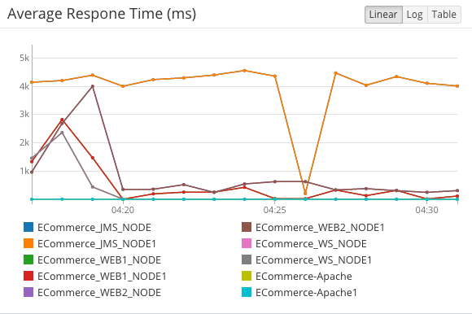|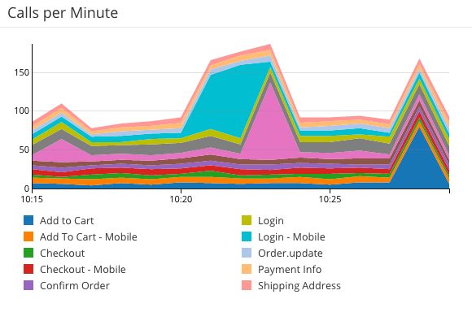|
|**bar-chart**|**heat-map**|
|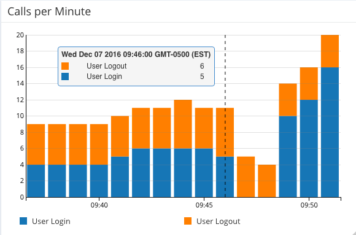|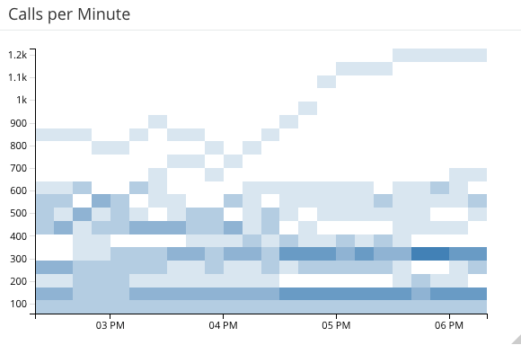|
|**line-chart [compact]**|**area-chart [compact]**|
|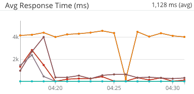|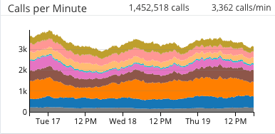|
|**bar-chart [compact]**|**heat-map [compact]**|
|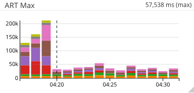||

| hi-lo-avg [normal, warning, critical]|
| :-------------:|
|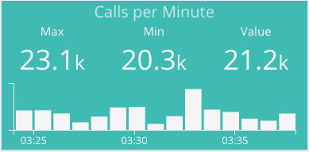 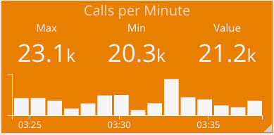 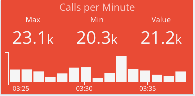 |
|**average-last [normal, warning, critical]**|
|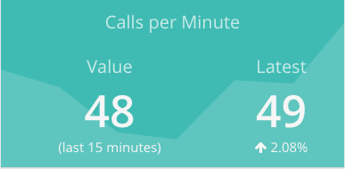 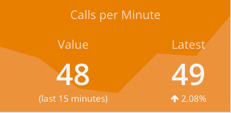 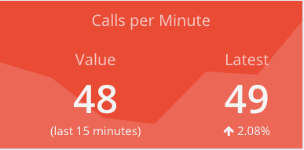 |
|**donut [normal, warning, critical]**|
|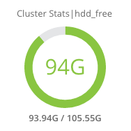 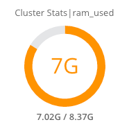 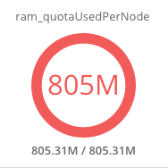 |
|**metric-table [text mode]**|
|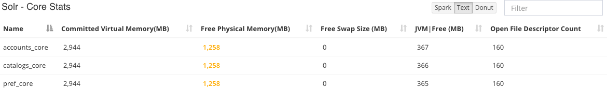|
|**metric-table [sparkline mode]**|
|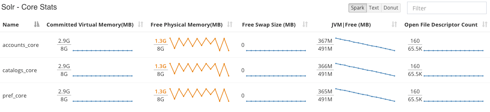|
|**metric-table [donut mode]**|
|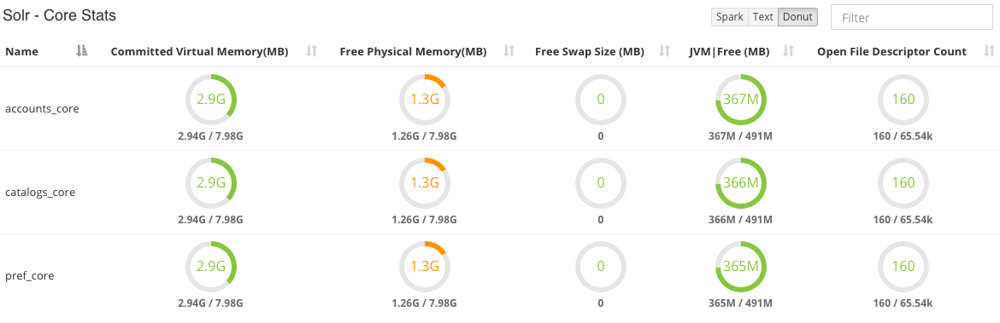|

## 2. Installation
TBD
## 3. Configuration
The dashboard configuration files are located at dashboard/\*\*. The files are 
### 3.1 `dashboards/dashboards.json`
This file should contains the list of dashboards. The menu at the top of the screen is rendered by this. The dashboard specific json files should be added to the `directory`.
<table>
<tr>
<td>
<pre>

[{
    "name": "Solr Monitor",
    "directory": "solr"
  },{
    "name": "Docker Monitor",
    "directory": "docker"
  }
]
</pre>
</td>
<td>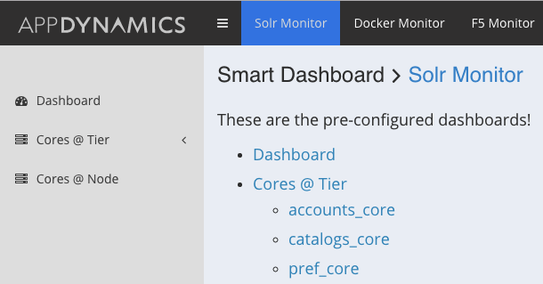</td>
</tr>
</table>
### 3.2 `dashboards/$directory/config.json`
The base configuration file. You can set the `application` name and the base metric path in this file.
```
{
  "application": "ECommerce",
  "basePath": "Application Infrastructure Performance|AccountService|Custom Metrics|Docker",
  "timeRanges": [
    {"durationInMins": 5, "name": "last 5 minutes"},
    {"durationInMins": 15, "name": "last 15 minutes"},
    ...
  ],
  "selectedTimeRange": {
    "durationInMins": 240,
    "name": "Last 4 hours"
  },
  "timeRangeDisabled": false,
  "autoRefresh": {
    "enabled": false,
    "frequencyInMins": 1
  },
  "gridsterOpts": {
  ...
  }
}
```
**Mandatory Args**
- `application`: The application name in the controller
- `basePath`: The base metric path. The metric paths in the charts will be relative to this path. 
**Optional Args**
- `timeRanges`: The data in the timerange dropdown will be fed by this value. If omitted, the defaults [15 mins to 4 hours] will be used.
- `selectedTimeRange`: The default timerange that will be selected.
- `autoRefresh`: If enabled, the page will be auto refershed with the set interval.
- `gridsterOpts`: The details of the grid can be controlled by this. Please refer to `gridsterOpts` @ [Angular Gridster Project] (https://github.com/ManifestWebDesign/angular-gridster/blob/master/README.md) for details

### 3.3 `dashboards/$directory/dashboards.json`
The list of dashboards for this dashboard package referenced by the `$directory` name.  This files feeds the contents of the left nav menu.
#### 3.3.1 Static Dashboard
This is the configuration for a static dashboard. The dashboard configurations will be loaded from the file `dashboard-$id.json` which will be resolved to `dashboard-home.json`
```
[
  {
    "id": "home",
    "name": "Dashboard",
    "iconClass": "fa fa-dashboard"
  }
]

```
#### 3.3.2 Dynamic Dashboard
This can be used to generate a dashboard dynamically with a template. In the given example, the `metricPath` will be resolved to `Application Infrastructure Performance|AccountService|Custom Metrics|Docker|*|Summary|Image Count`, where `*` in this case resolves to the name of the docker host.
eg. Application Infrastructure Performance|AccountService|Custom Metrics|Docker|`dockerhost1.example.com`|Summary|Image Count
<table>
<tr>
<td>
<pre>
[{
    "id": "servers",
    "name": "Servers",
    "type": "dynamic",
    "metricPathType": "metric",
    "iconClass": "fa fa-server",
    "metricDef":{
      "metricPathSuffix": "*|Summary|Image Count",
      "metricNameIndicesInSuffix": [0]
    }
}]
</pre>
</td>
<td></td>
</tr>
</table>
- `metricPath|metricPathSuffix`: if the suffic is used, it should be a relative path i.e relative to one given on `config.json`. Else it should be the full path.
- `metricNameIndices|metricNameIndicesInSuffix`: if suffix is used, the indices should be relative to the relative path
- `metricPathType`: Means that the path resolves to a metric leaf, rather than a folder.

The following example shows the dynamic menu resolving down 2 levels. It resolves to docker host [`dockerhost1.example.com`] and the containers [`/rabbitmq_rabbit1_1`] in each host.
<table>
<tr>
<td>
<pre>
[{
    "id": "containers",
    "name": "Containers",
    "type": "dynamic",
    "metricPathType": "metric",
    "iconClass": "fa fa-server",
    "metricDef": {
      "metricPathSuffix": "*|*|CPU|Total %",
      "metricNameIndicesInSuffix": [0,1]
    }
}]
</pre>
</td>
<td>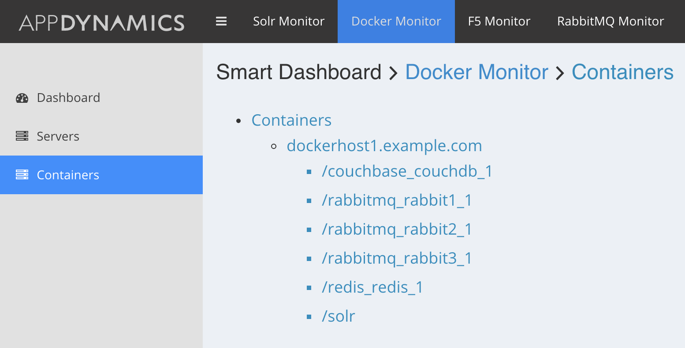</td>
</tr>
</table>
eg. Application Infrastructure Performance|AccountService|Custom Metrics|Docker|`dockerhost1.example.com`|`rabbitmq_container`|CPU|Total %

### 3.4 `dashboards/$directory/dashboard-$id.json`
The dashboard can contain multiple tabs. Each tab contains multiple widgets.
```
{
  "title": "Docker",
  "tabs":[
    {
      "name": "Dashboard",
      "widgets":[
        {
          "row": 0,
          "col": 0,
          "sizeX": 2,
          "sizeY": 1,
          "type": "hi-lo-avg",
          "clusterRollupType":"avg|sum",
          "metricDefs": [
            {
              "metricPathSuffix": "*|Summary|Container Count",
              "metricNameIndicesInSuffix": [2],
              "timeRollupType": "avg|sum",
              "outlier": {..},
              "threshold": {..}
            }
          ],
          "header": {..},
          "legend": {..},
          "outlier": {..}
        },
        {...}
       ]
    }
  ]
}
```
- `row`,`col`,`sizeX`,`sizeY`: Defines the position and the size of the widget in the grid. By default, there are 6 columns in the grid.
- `type`: `line-chart|heat-map|area-chart|bar-chart|hi-lo-avg|average-last|donut|metric-table`
- `clusterRollupType`: If set, the results returned by the metrics(`metricDefs`) will be rolledup based on the type (avg|sum). This only makes sense for label like metrics `hi-lo-avg|average-last|donut`.
- `metricDefs`: Defines what metrics to be fetched.
  * `metricPath|metricPathSuffix` : The absolute path or relative path to the metric. The relative path is relative to the config.json.
    * eg. `"metricPathSuffix": "*|Summary|Container Count"` - This will be resolved to multiple metrics due to the `*`
    * eg. `"metricPathSuffix": "{x}|Summary|Container Count"` - This `{x}` is used in dynamic dashboards (section 3.3.2). The `{x}` will be replaced by the metric name index resolved in the `dashboards/$directory/dashboards.json`.  
  * `metricNameIndices|metricNameIndicesInSuffix`: The indices to resolve the name of the metrics
  * `timeRollupType`: How to find the time rollup value of the metric.
  * `maxMetricPath|maxMetricPathSuffix`: This is used to find the max value of the give metric. This is used for health rules or it can be used to show the value in donut.
  * `maxIdentifierIndices|maxIdentifierIndicesInSuffix`: The identifier for max metric path.
  * `application`: Optional, if not set it will use the one set in config.json
  * `excludes`: Regex to exclude the resolved metrics eg. `[".*Average.*"]`

#### 3.4.1 Special Cases
This section defines the additional special attributes available for the widgets.

##### 3.4.1.1 `line-chart`
The default selected mode of the chart
```
"widget":[{
    "mode": "linear|log|table"
}]
```
##### 3.4.1.2 `donut`
```
"widget":[{
    "titleIndices":[0]
    "titleIndicesInSuffix":[0]
}]
```
##### 3.4.1.2 `metric-table`
```
"widget": {
    "itemsPerPage": 50,
    "tableType": "donut", # Default selected mode
    "metricDefs": [{
      "rowIdentifiers": [3],
      "rowIdentifiersInSuffix": [3],
      "columnIdentifiers": [4],
      "columnIdentifiersInSuffix": [4],
     }]
  }
```
